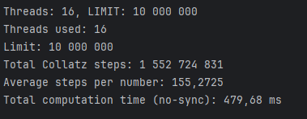

# Паралельне обчислення гіпотези Колаца без синхронізації

## Опис завдання

Програма реалізує паралельне обчислення кількості кроків для чисел за **гіпотезою Колаца** у діапазоні від `1` до `10 000 000`.

Мета роботи:
- згенерувати `10 000 000` натуральних чисел у головному потоці
- паралельно обчислити кількість кроків до виродження в `1` для кожного з них
- після закінчення обчислень знайти середню кількість кроків
- **уникнути використання об’єктів синхронізації** 

---

## Алгоритм роботи

### Генерація чисел
У головному потоці програма генерує масив натуральних чисел від `1` до `LIMIT` (за замовчуванням — `10 000 000`).

### Розподіл роботи між потоками

Програма визначає кількість потоків. За замовчуванням це кількість логічних ядер ЦП.

Діапазон чисел розділяється статично на приблизно рівні частини. Кожен потік отримує власну частину масиву й обробляє тільки її, не маючи спільних точок запису з іншими потоками.

### Обчислення кроків гіпотези Колаца

Кожен потік виконує підрахунок для «свого» діапазону чисел, використовуючи функцію.

### Збір результатів

Кожен потік записує проміжну суму лише у свій індекс масиву partialSums[]. Після завершення обчислень головний потік підсумовує результати та обчислює середнє значення.

### Різниця між використанням синхронізації та без неї

У ДЗ3 програма використовувала динамічний розподіл роботи між потоками. Це означає, що всі потоки зверталися до спільного лічильника (AtomicInteger, LongAdder), який визначав, які числа залишилися для обчислення. Такий підхід вимагав синхронізації, бо потокам потрібно було узгоджувати доступ до спільних змінних, щоб не виникало конфліктів. Через це частина часу процесора витрачалася не на обчислення, а на очікування, поки інші потоки звільнять спільні ресурси.

У новій версії цього алгоритму реалізовано статичний розподіл. Діапазон чисел від 1 до LIMIT ділиться наперед на рівні частини й кожен потік отримує свій власний блок чисел. Потоки працюють незалежно, без спільних змінних, і записують результати лише у власну комірку пам’яті. Завдяки цьому відпала потреба в синхронізації, що суттєво спростило логіку програми та час, витрачений на обчислення.

Різницю швидкості обчислення можна помітити, порівнявши дані з  та 